# 王智寬 <span style="color:red">(106062601)</span>

# Project 1 / Image Filtering and Hybrid Images

## Overview
Project 1 內容為實作出與<code>scipy.misc.imfilter</code>功能相近的Image Filtering，並將實作內容存在<code>my_imfilter</code>中，再用使用<code>my_imfilter</code>來分別取得不同image的高頻及低頻資訊，於<code>proj1.py</code>中實作出能產生Hybrid Images的程式。

藉由調整<code>cutoff_frequency</code>(gaussian filter的標準差)和<code>alpha</code>(減去的低頻資訊比例)，可以得到較佳的視覺化結果。

<a href="https://github.com/moopene36607/CV_homework1/tree/master/homework1-1-master">public version</a>
## Implementation
### 1. my_imfilter.py
* reflect padding

首先將imfilter擴增成float64，如此才不會喪失高頻資訊。再藉由imfilter的size決定需要做多少大小的padding，最後用<code>np.pad</code>來完成reflect padding，並將padding後的結果存於image_pad變數中。

    ```
    imfilter = np.asarray(imfilter, dtype=np.float64)
    frow_num = len(imfilter)
    fcol_num = len(imfilter[0])
    pad_x = int((fcol_num - 1 ) / 2)
    pad_y = int((frow_num - 1 ) / 2)
    image_pad = np.pad(image, ((pad_x, pad_x), (pad_y, pad_y), (0, 0)), 'reflect')
    ```

* convolution

找出input的row, column, channel並分別存在irow_num, icol_num, channel變數中，創建同樣大小的output array來儲存等一下convolution的結果，再利用for loop去計算imfilter對image_pad做convolution。

```
    irow_num = len(image)       
    icol_num = len(image[0])     
    channel  = len(image[0][0])
    output = np.zeros_like(image)
    for ro in range(0,irow_num):
        for co in range(0,icol_num):
            for ch in range(0,channel):
                output[ro][co][ch] = np.sum(imfilter * image_pad[ro:ro+frow_num, co:co+fcol_num, ch])
    return output
```
Note:如果不使用broadcast，而使用兩個for-loop來做convolution，效率會大幅下降。


### 2. proj1.py
* load images
	
讀取兩張不同images，分別存入image1, image2，並讓他們的rgb介於0~1之間。image1將保留低頻資訊、image2將保留高頻資訊。

```
main_path = os.path.dirname(os.path.dirname(os.path.abspath(__file__)))
image1 = mpimg.imread(main_path + '/data/banana.PNG')      
image2 = mpimg.imread(main_path + '/data/sunflower.PNG')   
image1 = image1.astype(np.single)/255
image2 = image2.astype(np.single)/255
```

* gaussian filter

用cutoff_frequency這個hyperparameter設定gaussian filter的標準差，使用助教提供的<code>gauss2D.py</code>宣告二維的Gaussion mask，並藉由調整cutoff_frequency來產生較佳的Hybrid Images。

```
cutoff_frequency = 9
gaussian_filter = gauss2D(shape=(cutoff_frequency*4+1,cutoff_frequency*4+1), sigma = cutoff_frequency)
```

* low frequencies
	
呼叫剛剛實做的<code>my_imfilter</code>，使用gaussian_filter來過濾image1的高頻資訊，取得模糊的image1。

```	
low_frequencies = my_imfilter(image1, gaussian_filter);
low_frequencies = normalize(low_frequencies)
```

* high frequencies

呼叫剛剛實做的<code>my_imfilter</code>，使用gaussian_filter來產生image2的低頻資訊，再原圖減去低頻資訊來去除低頻資訊，如此只保留image2的高頻資訊。並藉由設定alpha，調整要減去的低頻資訊比例，來產生較佳的Hybrid Images。

```
low_frequencies_2 = my_imfilter(image2, gaussian_filter);
alpha = 1
high_frequencies = image2 - alpha*low_frequencies_2 
high_frequencies = normalize(high_frequencies)
```

* hybrid image

將image1的低頻資訊和image2的高頻資訊結合，以產生出hybrid image。

```
hybrid_image = normalize(low_frequencies + high_frequencies)
```


## Installation
* scipy
* numpy
* matplotlib
* os

### Results(quick look)
* Given tasks
<table border=1>

<tr>
<td colspan="4">
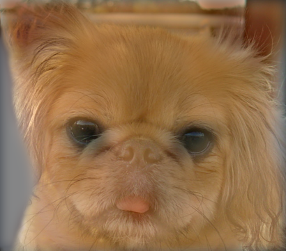
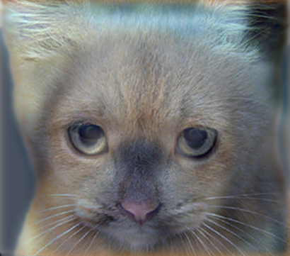
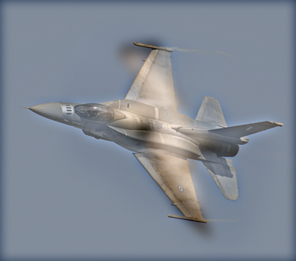
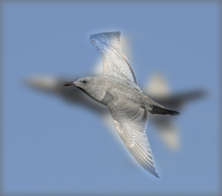
</td>
</tr>

<tr>
<th>(a)</th>
<th>(b)</th>
<th>(c)</th>
<th>(d)</th>
</tr>

<tr>
<td colspan="4">
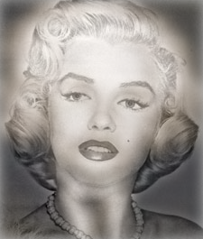
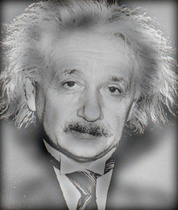
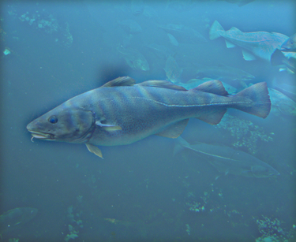
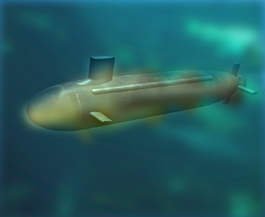
</td>
</tr>

<tr>
<th>(e)</th>
<th>(f)</th>
<th>(g)</th>
<th>(h)</th>
</tr>

<tr>
<td colspan="4">
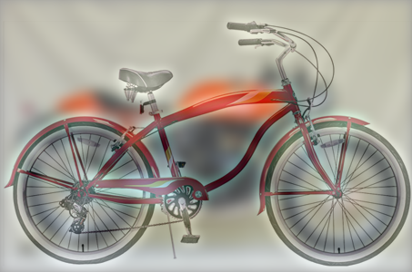
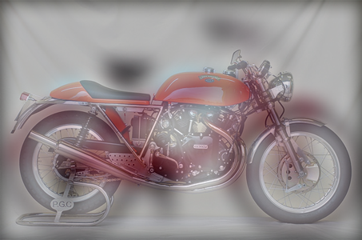
</td>
</tr>

<tr>
<th>(i)</th>
<th>(j)</th>
</tr>
</table>

cutoff_frequency太高(高於11)，容易因為image1太過模糊，使合成圖即使縮小也很難看出image1所帶的低頻資訊。

cutoff_frequency太低(低於6)，容易因為image1太過清晰，使得合成圖中image1嚴重干擾image2的高頻資訊。

alpha越高，image2去除的低頻資訊越多，建議設定在0.7到1.4之間。

以下說明實驗數據

(a)(b)使用了cat和dog兩張圖，並設定cutoff_frequency=7, alpha=1

(c)(d)使用了bird和plane兩張圖，並設定cutoff_frequency=8, alpha=0.9

(e)(f)使用了einstein和marilyn兩張圖，並設定cutoff_frequency=7, alpha=1

(g)(h)使用了fish和submarine兩張圖，並設定cutoff_frequency=8, alpha=1.1

(i)(j)使用了motorcycle和bicycle兩張圖，並設定cutoff_frequency=9, alpha=1.2


* Bonus
<table border=1>
<tr>
<td colspan="2">
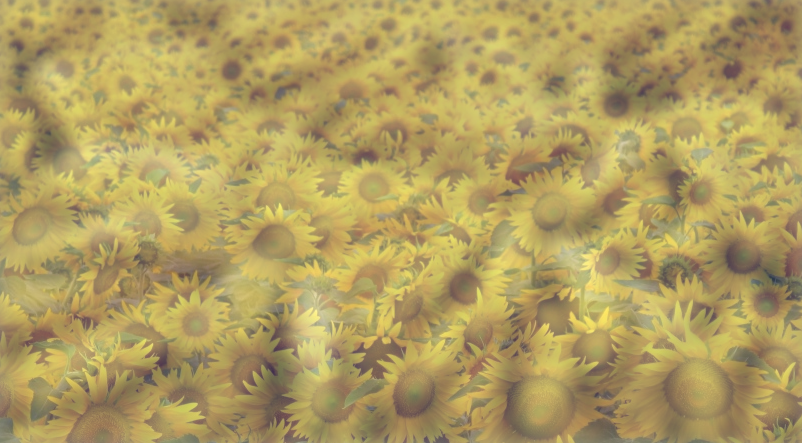
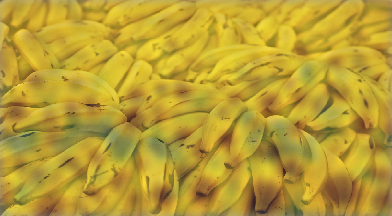

</td>
</tr>

<tr>
<th>(k)</th>
<th>(l)</th>
</tr>

<tr>
<td colspan="2">
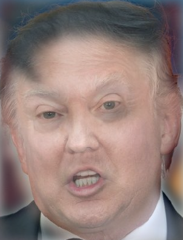
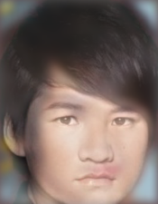
</td>
</tr>

<tr>
<th>(m)</th>
<th>(n)</th>
</tr>

<tr>
<td colspan="2">
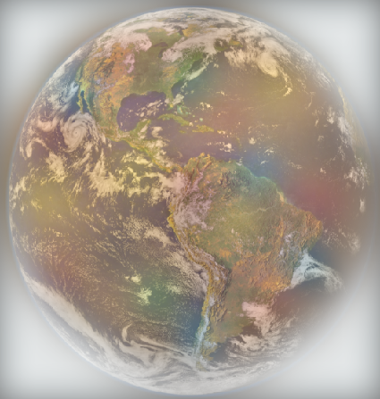
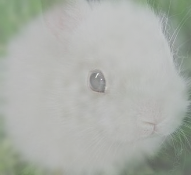
</td>
</tr>

<tr>
<th>(o)</th>
<th>(p)</th>
</tr>
</table>

由(k)(l)可看出，若合成的圖片顏色分佈相近，縱使輪廓不相同，合成效果仍相當不錯

由(m)(n)可看出，對於原先就很相近的圖片，原圖解析度夠高，合成圖才容易看出效果

由(o)可看出，及使顏色分佈差異很大，但只要輪廓相同，合成效果仍相當不錯

綜合上述，好的合成圖要由顏色分佈或輪廓其中一個要素相近的兩張圖來合成，效果最佳

若兩張圖的顏色分佈和輪廓接相近，則解析度要夠高

以下說明實驗數據

(k)(l)使用了banana和sunflower兩張圖，並設定cutoff_frequency=8, alpha=0.8

(m)使用了kin和trump兩張圖，並設定cutoff_frequency=9, alpha=1

(n)使用了gerger和nini兩張圖，並設定cutoff_frequency=9, alpha= 1

(o)使用了cookie和earth兩張圖，並設定cutoff_frequency=10, alpha=0.8

(p)使用了dandelion和bunny兩張圖，並設定cutoff_frequency=6, alpha=0.7

### Results(scales)
* Given tasks
<table border=1>
<tr>
<td>
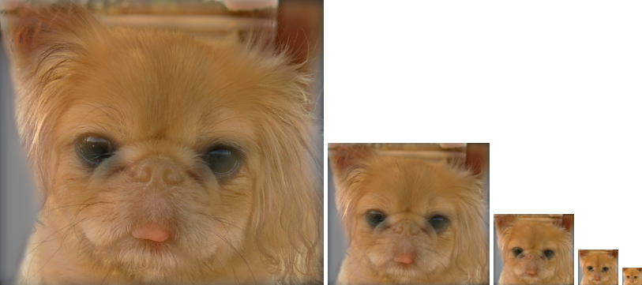
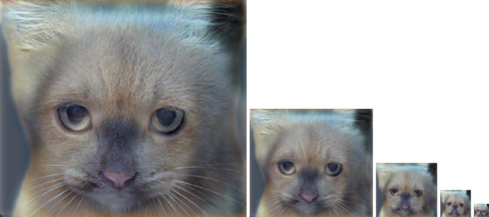
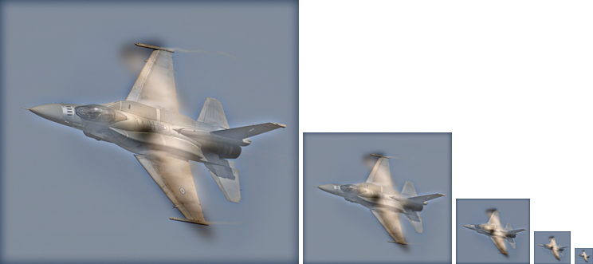
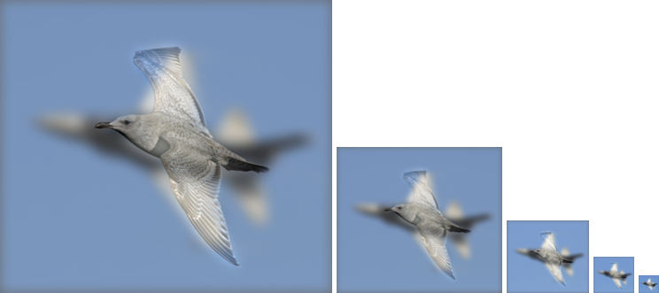
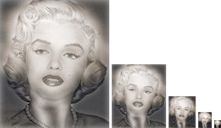
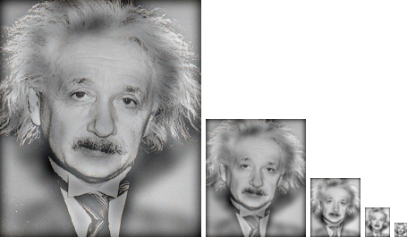
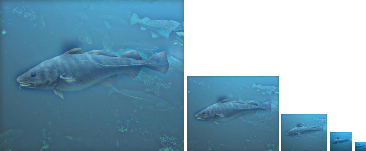
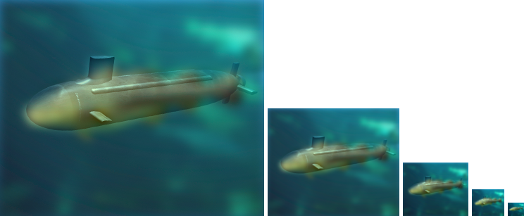
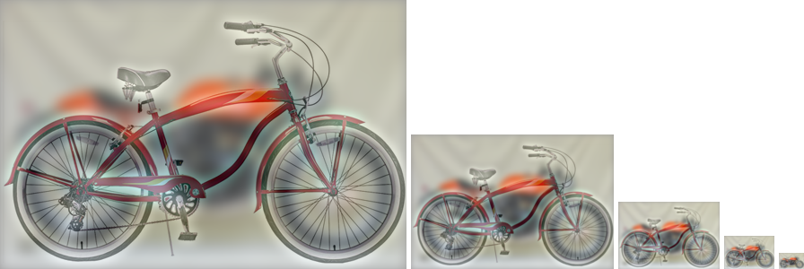
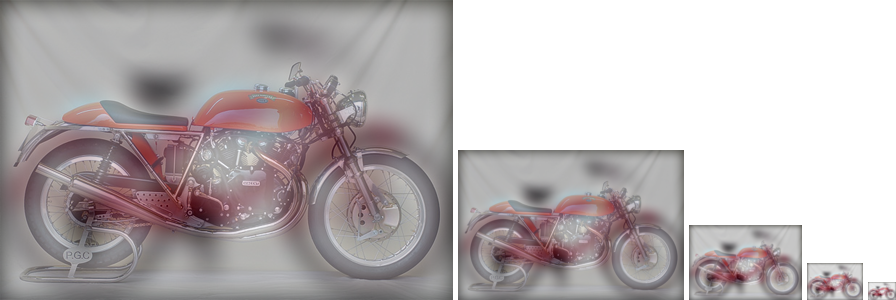
</td>
</tr>


</table>

* Bonus
<table border=1>
<tr>
<td>
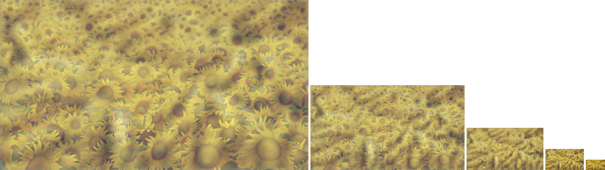
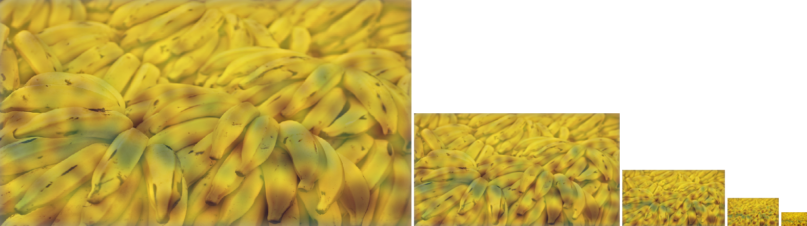
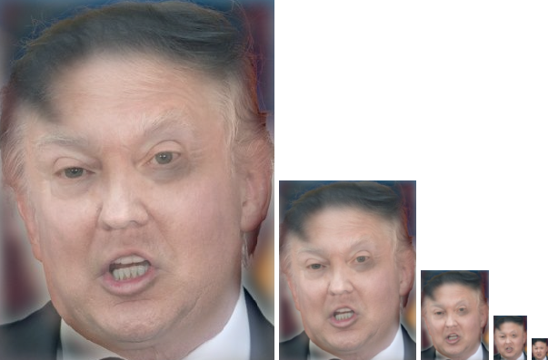
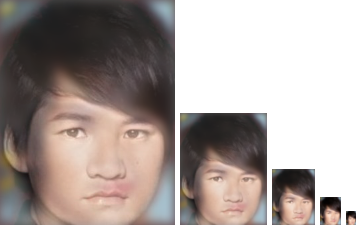
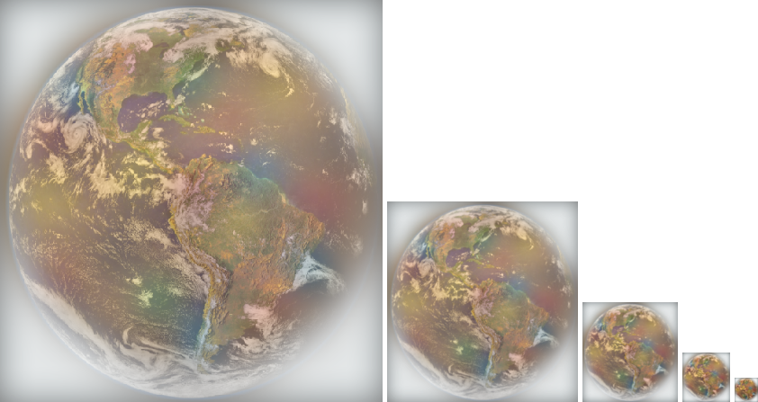
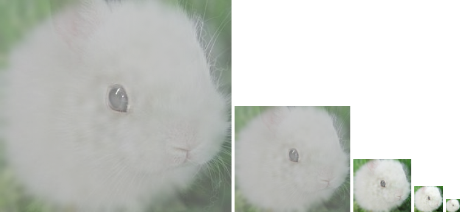
</td>
</tr>
</table>
